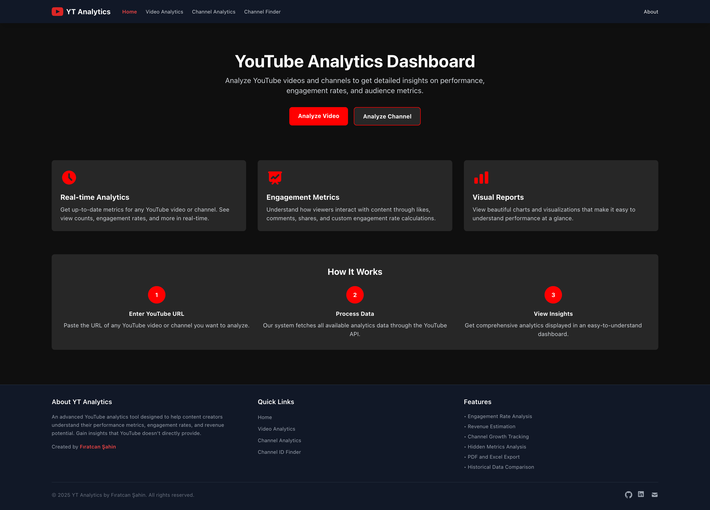
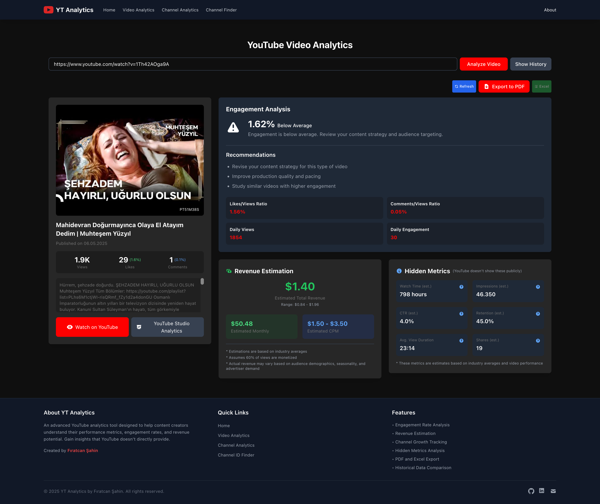
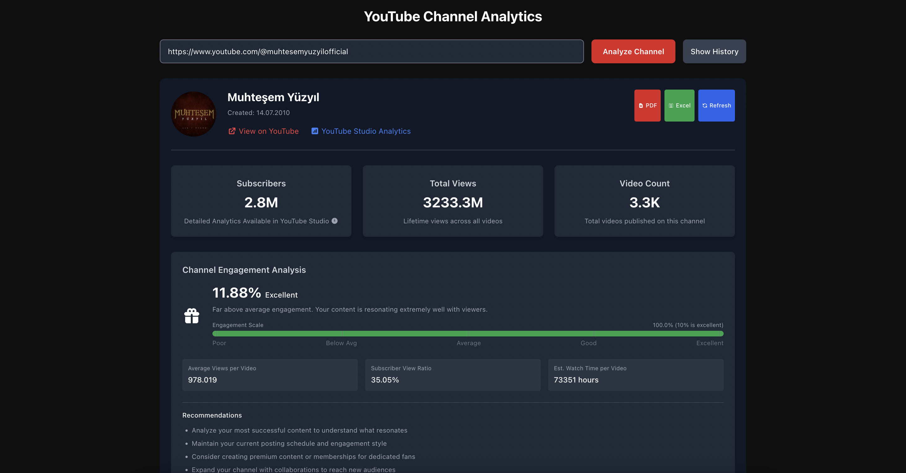
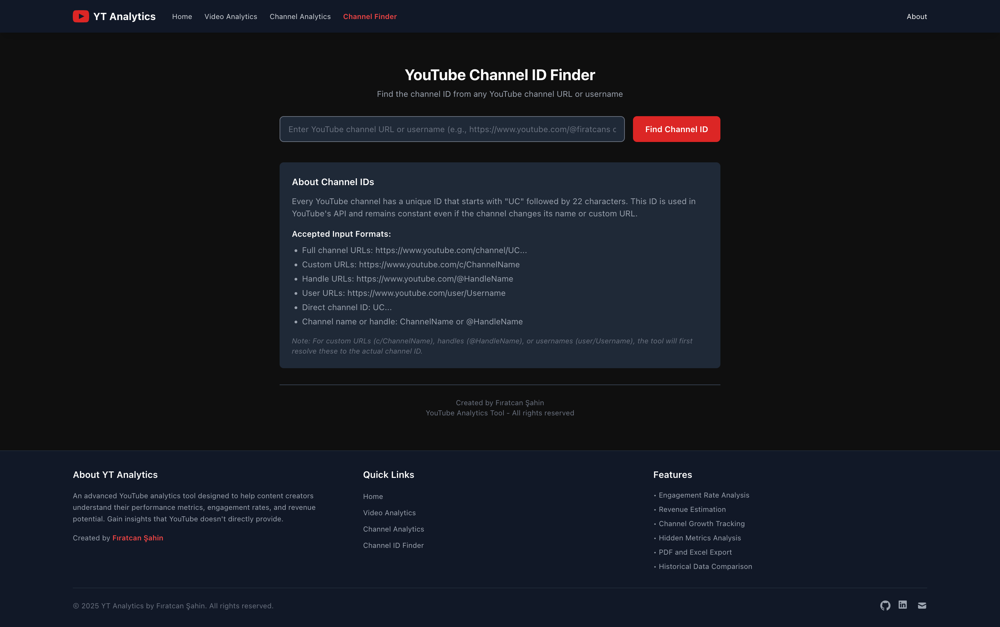

# YouTube Analytics Tool - Setup Guide

## Application Screenshots

### Home Page
[](screenshots/home.png)

### Video Analysis
[](screenshots/video-analysis.png)

### Channel Analysis
[](screenshots/channel-analysis.png)

### Enter Channel ID
[](screenshots/channel_id.png)


## System Requirements
- Node.js (v14 or higher)
- npm (v6 or higher)
- A YouTube Data API v3 key

## Initial Setup

1. Clone the repository:
```
git clone https://github.com/firatcansahin/Youtube-Data-Analysis-Tool.git
cd yt-analysis
```

2. Create a `.env` file in the root directory with your YouTube API key:
```
YOUTUBE_API_KEY=your_youtube_api_key_here
```

3. Install dependencies for both server and client:
```
npm install
cd client
npm install
cd ..
```

## Running the Application

### Development Mode
To run the application in development mode with both server and client:
```
npm run dev
```

This will start:
- The backend server on port 5002
- The React client on port 3000

### Running Separately
If you need to run the server and client separately:

For the server:
```
npm run server
```

For the client:
```
npm run client
```

## Troubleshooting Common Issues

### Port Conflicts
If you encounter a port conflict error ("address already in use"), you can:

1. Kill the process using the port:
```
# For port 5002 (server)
lsof -i :5002 | grep LISTEN | awk '{print $2}' | xargs kill -9

# For port 3000 (client)
lsof -i :3000 | grep LISTEN | awk '{print $2}' | xargs kill -9
```

### API Key Issues
If you encounter API errors:
1. Verify your API key is correct in the `.env` file
2. Check that your YouTube Data API is enabled in the Google API Console
3. Verify you haven't exceeded your daily quota limits

## Project Structure

- `server.js` - Express backend server
- `client/` - React frontend application
  - `src/` - React source code
    - `components/` - Reusable UI components
    - `pages/` - Page components
    - `utils/` - Utility functions
    - `App.js` - Main app component with routing

## Features

1. **Video Analytics**: Analyze individual YouTube videos
   - URL: http://localhost:3000/video

2. **Channel Analytics**: Analyze YouTube channels
   - URL: http://localhost:3000/channel

3. **Channel Finder**: Find channel IDs from URLs or usernames
   - URL: http://localhost:3000/channel-finder

## Getting a YouTube API Key

1. Go to the [Google Cloud Console](https://console.cloud.google.com/)
2. Create a new project
3. Navigate to "APIs & Services" > "Library"
4. Search for "YouTube Data API v3" and enable it
5. Go to "Credentials" and create an API key
6. Restrict the API key to YouTube Data API v3 only (recommended)
7. Copy the API key to your `.env` file

## Dependencies

### Backend
- express - Web server framework
- axios - HTTP client for API requests
- cors - Cross-origin resource sharing
- dotenv - Environment variable management
- nodemon - Development server with auto-reload

### Frontend
- react - UI library
- react-router-dom - Routing
- axios - HTTP client
- tailwindcss - Utility-first CSS framework
- chart.js & react-chartjs-2 - Charting library
- react-hot-toast - Toast notifications
- jspdf - PDF generation
- xlsx - Excel file generation

## Notes
- The application uses port 5002 for the backend and port 3000 for the frontend
- All data is fetched from the YouTube Data API v3
- No data is stored permanently - everything is fetched on demand
- API quota usage is approximately:
  - 1 unit per video lookup
  - 1-3 units per channel lookup (depending on data requested)

## Credits
Developed by Fıratcan Şahin 
